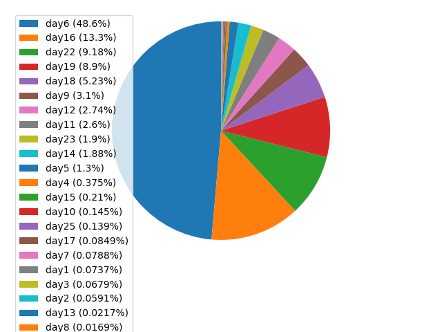

# Advent of Code 2024


This Repository contains some solutions for advent of code 2024 as well as a CLI to make some things easier.  
Feel free to use the solutions, as well as the rest of this repo for whatever you want.

## CLI

The CLI is meant to automate some things and make youre life easier. Here a the available commands:

- `create n` - is used to initialize all files needed for a new day with number `n`. These include `aoc/days/day{n}.py` and `aoc/input/day{n}.test.txt` (the normal input file is downloaded automatically when running the corresponding python file)
- `run n` - this command runs the `aoc/days/day{n}.py` file. If `aoc/input/day{n}.txt` isn't present, it will automatically be downloaded from the [Advent of Code Website](https://adventofcode.com)
- `runall` - this command runs all available days in the `days/` directory. Be careful when using this command, as running days when the input file is not present will result in the input being downloaded. This might send a lot of requests.
- `update-badge` - this command will fetch user-data from the AoC Website and update the Badges in the `README.md` accordingly.

For all options you can run the `aoc` module with the `--help` flag.  
If you use the CLI, make sure you install all dependencies specified in the `pyproject.toml` file.

### Setup

It's generally recommended, to create a virtual environment and install the project there:

```bash
python3 -m venv .venv
source .venv/bin/activate
pip install .
python3 -m aoc
```

## Project Structure

```
.
├── aoc
│  ├── days
│  │  ├── day1.py
│  │  ├── day2.py
│  │  └── ...
│  ├── input
│  │  ├── day1.test.txt
│  │  ├── day1.txt
│  │  └── ...
│  ├── util
│  │  ├── __init__.py
│  │  ├── bench.py
│  │  ├── env.py
│  │  ├── fetch.py
│  │  ├── file.py
│  │  ├── parse.py
│  │  └── read.py
│  ├── __init__.py
│  ├── __main__.py
│  └── template.py.txt
├── README.md
├── benchmark.png
├── example.env
├── pyproject.toml
└── uv.lock
```

All Code is contained in the `aoc` module, which is also executable.

The CLI for managing solutions etc. is contained in the `__main__.py` file in the top-level module.
All solutions for the days are contained in the `aoc/days/` directory.
Days that get created via the CLIs `create` command get populated with the contents of `template.py.txt`, where `{day}` gets replace with the actual number.

The corresponding input files are stored in the `aoc/input/` directory, which is gitignored, because the author of AoC [does not want that parts get reuploaded](https://adventofcode.com/2024/about). If you clone this repo, please keep it like this.
The `aoc/input/` directory will get created automatically when needed.

The module `aoc.util` contains various helper method for the CLI, as well as the challenges themselves.

If you clone this repo, make sure to create an `.env` file, which contains youre AoC Session-Token as well as youre userid (see `example.env`).
Both can be found on the AoC website (see [here](https://github.com/wimglenn/advent-of-code-wim/issues/1) for help).

## Benchmark

I am not really focused on execution speed. But it might be interesting to see, how the days compare against each other.  
When running the `runall` Command, the `--plot` flag can be specified, to generate a pie chart of the execution times:


